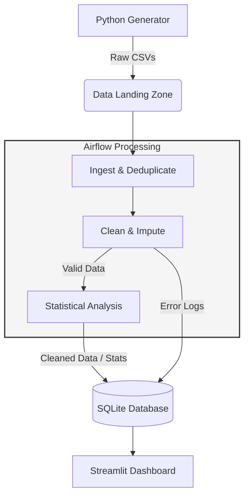

# Engine Telemetry Pipeline
A robust data engineering pipeline for ingesting, validating, and analyzing synthetic combustion engine telemetry using Apache Airflow, Python, and SQLite.

## Project Structure
```text
   .
   ├── dags/
   │   └── process_engine_data.py   # Airflow DAG logic
   ├── engine_data/                 # Raw CSV Landing Zone (Generated)
   ├── logs/                        # Airflow Task Logs (Tracked via .gitkeep)
   ├── results/
   │   └── engine_analytics.db      # SQLite Database (Output)
   ├── utils/
   │   └── config.py                # Shared Source of Truth for Thresholds
   ├── generator.py                 # Telemetry Simulation Engine
   ├── visualize_results.py         # Streamlit Dashboard
   ├── docker-compose.yaml          # Airflow Infrastructure
   ├── Dockerfile                   # Custom image with Pandas/Plotly
   └── README.md
```

## 1: Engine Telemetry Generator

The first component is a Python-based simulation engine. It is designed to model realistic internal combustion engine behavior while intentionally introducing data quality issues to test pipeline resilience.

### Telemetry Specification
Each engine produces a CSV file containing 90 minutes of data with the following schema:

| Field | Type | Description |
| :--- | :--- | :--- |
| `timestamp` | ISO-8601 | UTC timestamp of the sensor reading. |
| `engine_id` | String | Unique identifier for the asset (e.g., `ENG-001`). |
| `rpm` | Float | Engine Revolutions Per Minute. |
| `temp` | Float | Engine temperature in Celsius (°C). |
| `oil_pressure`| Float | Lubrication system pressure in Bar. |
| `fuel_cons` | Float | Rate of fuel consumption. |
| `status` | String | Logic-based health state (`running`, `warning`, `error`). |

### Chaos Engineering & Data Quality
The generator injects "Realistic Anomalies" to validate the Airflow ETL's cleaning logic:

* **Duplicate Injection:** A 5% probability check triggers a "double-write" of the current telemetry row, simulating sensor stutter or network retries.
* **Sentinel Values:** `RPM` may drop to `-999.0` or `Temp` may spike to `999.9` to simulate hardware sensor failure.
* **Null Values:** `oil_pressure` occasionally reports as `None` (empty in CSV) to simulate intermittent signal loss.
* **Shared Config Validation:** Thresholds for "Normal" vs "Anomalous" data are pulled directly from `utils/config.py`, ensuring the Generator and the DAG use the same Source of Truth.

### How to Run
1. Ensure you have Python 3.x and install requirements .
   ```bash
   pip install -r requirements.txt

2. Run the generator script:
   ```bash
   python generator.py
   ```

## 2: Environment & Orchestration

This project uses **Docker Compose** to manage the Apache Airflow environment. This ensures that the pipeline, database, and dependencies (like Pandas) are consistent across any machine.

### Infrastructure Components
* **Airflow Webserver/Scheduler:** Orchestrates the data flow.
* **Postgres:** Stores Airflow metadata.
* **Custom Dockerfile:** Extends the base Airflow image to include `pandas` and `scipy` for data transformation.

### Environment Setup
1. **Prerequisites:** Install [Docker Desktop](https://www.docker.com/products/docker-desktop/).
2. **Start the Environment:**
   ```bash
   docker compose up --build -d
   ```
3. **Initialize the Database:** (Required on first run)
   ```bash
   docker compose run --rm airflow-webserver airflow db migrate
   ```
4. **Create Admin User:**
   ```bash
   docker compose run --rm airflow-webserver airflow users create \
      --username admin \
      --firstname admin \
      --lastname admin \
      --role Admin \
      --email admin@example.com \
      --password admin
   ```

5. **Access Airflow UI:** Navigate to `http://localhost:8080` and log in with the default credentials (`admin`/`admin`).

Note: If `localhost` fails to connect on macOS, use `127.0.0.1` to bypass potential AirPlay port conflicts.

## 3: Data Pipeline (Airflow ETL)

The pipeline is orchestrated as a **DAG** (Directed Acyclic Graph) in Airflow, designed for reliable batch processing of IoT telemetry.

### Task Architecture: `process_engine_data`
A unified **PythonOperator** handles the end-to-end transformation logic to ensure atomic execution:

1. **Ingestion & Deduplication:** Aggregates multi-source CSVs from the `/opt/airflow/engine_data` volume and enforces unique constraints on `engine_id` and `timestamp`.
2. **Validation (Shared Config):** Validates sensor ranges (RPM, Temp, Oil Pressure, Fuel Consumption) against the `config.py` "Source of Truth." 
3. **Data Imputation:** Dynamically replaces out-of-range sensor values with the mean for that specific `engine_id` to maintain data continuity.
4. **Statistical Aggregation:** Computes batch-level performance metrics (Mean, Median, Min, Max) for each engine.

### Pipeline Execution
1. **Trigger:** The DAG runs on an `@hourly` schedule or via manual trigger.
2. **Persistence:** Cleaned datasets and calculated statistics are persisted to a SQLite database.
3. **Data Quality Monitoring:** Validation failures are captured in a dedicated `validation_errors` table, while runtime execution details are stored in Airflow Task Logs.

### Design Decisions

* **Orchestration (Airflow):** Chosen for its robust retry logic and native ability to handle batch-based IoT telemetry.
* **Cleaning Strategy (Imputation):** Instead of dropping rows with sensor spikes (which creates gaps in time-series data), I chose to **impute using the engine-specific mean**. This preserves the timeline for more accurate statistical analysis.
* **Database (SQLite):** Selected for its "zero-config" portability, allowing the reviewer to inspect results without setting up a database server.
* **Validation (Shared Config):** By using a central `utils/config.py`, I ensured that the Generator (Source) and the ETL (Processing) stay synchronized, preventing "logic drift" as sensor thresholds evolve.

## Database Schema
The pipeline persists data to `results/engine_analytics.db` with the following structure:

- `cleaned_telemetry`: Deduplicated and imputed sensor readings (`rpm`, `temp`, `oil_pressure`, `fuel_cons`).
- `engine_stats`: Summary table containing:
      -Identifiers: `engine_id`, `start_time`, `end_time`.
      -Aggregates: `[sensor]_mean`, `_median`, `_min`, `_max` for all numeric fields.
- `validation_errors`: Audit log capturing error_type and original_value for every intercepted anomaly.


## 4. Visualization & Data Quality Dashboard

To analyze the processed telemetry and verify the integrity of the ETL pipeline, a custom dashboard was built using **Streamlit** and **Plotly**.

### How to Run
Ensure the Airflow pipeline has completed at least one run, then execute:
```bash
streamlit run visualize_results.py
```

### Dashboard Features
The application is organized into four strategic views:

1. **Engine Deep-Dive:** 
   - Synchronized Telemetry: Stacked charts for RPM, Temperature, and Oil Pressure sharing a common timeline to identify sensor correlations.
   - Sensor vs. Performance Stats: Overlays telemetry with Mean/Max thresholds from the engine_stats table

2. **Engine Comparison:**
   - Uses Box Plots to visualize the statistical distribution of sensors across all engines.
   - This view is critical for identifying "outlier" engines whose variance differs from the fleet norm.

3. **Error Audit & Pipeline Health:**
   - Fleet Snapshot: A bar chart ranking engines by the number of anomalies caught.
   - Health Scoring: Calculates a % reliability score based on the ratio of cleaned records vs. validation errors.
   - Anomaly Timeline: A scatter plot mapping exactly when sensor failures occurred during the simulation.

4. **Data Inspector:** 
   - Direct access to the SQLite database. Used to verify the raw state of the cleaned_telemetry, engine_stats, and validation_errors tables.

## System Architecture

